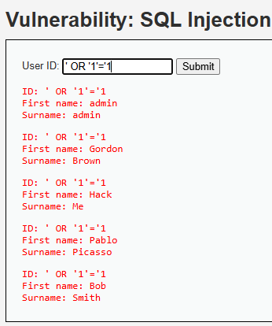

# 02 · Inyección SQL — Hotel Costa Brava

> **Informe A — Análisis de Vulnerabilidades · Criterios 3.1.1 / 3.1.4 / 3.1.5**
> Demostración del ataque de **inyección SQL** sobre el entorno controlado DVWA, su
> explicación, su gravedad (CVSS) y cómo lo prevendría/mitigaría Hotel Costa Brava.

## Objetivo de la sección

Demostrar cómo una inyección SQL permite **extraer toda la base de datos de clientes** del
portal, explicar **por qué** ocurre, medir su **gravedad** con CVSS y proponer las **medidas
de prevención y mitigación** adecuadas para un hotel.

---

## Qué es (en simple)

La base de datos del hotel guarda a todos los huéspedes. Cuando el portal busca "el cliente
N° X", le hace una **pregunta** (una consulta SQL) a esa base. La **inyección SQL** consiste
en escribir, dentro de un campo del formulario, un texto que **cambia esa pregunta** para
que la base devuelva mucho más de lo que debería.

Es como pedirle a un bibliotecario "tráeme el libro 5"… pero agregando "…o cualquier libro
que exista". El bibliotecario, al pie de la letra, te trae **todos** los libros.

---

## Evidencia del ataque

**Dónde:** módulo *SQL Injection* de DVWA (nivel de seguridad: *Low*).
**Qué se escribió** en el campo *User ID*:

```
' OR '1'='1
```

**Resultado:** en lugar de un solo usuario, el portal devolvió **todos** los registros
(admin, Gordon Brown, Hack Me, Pablo Picasso, Bob Smith).



> En un hotel real, esa lista no serían 5 usuarios de prueba, sino **miles de huéspedes**
> con sus nombres, documentos, correos y datos de contacto.

---

## Por qué funciona (explicación técnica)

El portal **construye la consulta pegando directamente** lo que escribe el usuario, entre
comillas:

```sql
-- Entrada normal: 1
SELECT nombre FROM users WHERE id = '1';        -- devuelve solo el usuario 1

-- Entrada maliciosa: ' OR '1'='1
SELECT nombre FROM users WHERE id = '' OR '1'='1';  -- '1'='1' es SIEMPRE verdadero
```

- La **comilla** (`'`) cierra antes de tiempo el dato que esperaba el sistema.
- `OR '1'='1'` agrega una condición que **siempre es verdadera**.
- Como la condición se cumple para *todas* las filas, la base devuelve la **tabla completa**.

**La causa de fondo:** la aplicación **no separa los datos del usuario de sus
instrucciones**. Trata lo que se escribe en el formulario como si fuera parte del código de
la consulta.

---

## Gravedad — CVSS 3.1

Calculado con la [calculadora oficial FIRST](https://www.first.org/cvss/calculator/3.1):

| Métrica | Valor | Razón |
|---|---|---|
| Vector de ataque (AV) | **Red (N)** | Se explota por internet, desde el navegador |
| Complejidad (AC) | **Baja (L)** | Basta escribir un texto en un campo |
| Privilegios (PR) | **Ninguno (N)** | Un formulario público (login/búsqueda) no requiere cuenta |
| Interacción (UI) | **Ninguna (N)** | No necesita engañar a otra persona |
| Alcance (S) | **Sin cambio (U)** | Afecta la misma aplicación/BD |
| Confidencialidad (C) | **Alta (H)** | Expone toda la base de clientes |
| Integridad (I) | **Ninguna (N)** | El ataque demostrado solo *lee* datos |
| Disponibilidad (A) | **Ninguna (N)** | No interrumpe el servicio |

**Vector:** `CVSS:3.1/AV:N/AC:L/PR:N/UI:N/S:U/C:H/I:N/A:N`
**Puntaje base: 7.5 — Severidad ALTA.**

> ⚠️ El ataque demostrado solo **lee** datos. Con técnicas adicionales de inyección, la misma
> falla suele permitir **modificar o borrar** registros (Integridad y Disponibilidad altas),
> elevando el puntaje a **9.8 — Crítico**. Es decir: 7.5 es el **piso**, no el techo.

---

## Impacto para Hotel Costa Brava

- **Fuga masiva de datos personales** de huéspedes (nombre, RUT/pasaporte, contacto) →
  riesgo de suplantación y fraude.
- **Exposición de datos de pago** si están en la misma base → fraude con tarjetas.
- **Incumplimiento legal** (Ley 19.628 de datos personales) → multas y notificaciones.
- **Daño reputacional**: un hotel que filtra los datos de sus huéspedes pierde su confianza.

---

## Prevención (3.1.4) — evitar que ocurra

Política de **desarrollo seguro** del hotel:

1. **Consultas parametrizadas (prepared statements) obligatorias** para todo acceso a la
   base de datos. La instrucción y los datos viajan por separado; el dato **nunca** se
   interpreta como código.
2. **Validación de entradas:** forzar el tipo esperado (p. ej. que `id` sea un número entero).
3. **Estándar de codificación segura** y **revisión de código** antes de publicar; análisis
   estático (SAST) en el pipeline.
4. **Capacitación** del equipo de desarrollo (incluido el código generado por IA, que a
   menudo concatena por defecto y hay que corregir).

```php
// VULNERABLE (concatena la entrada):
$sql = "SELECT nombre FROM users WHERE id = '$id'";

// SEGURO (consulta preparada — el dato jamás es SQL):
$stmt = $conn->prepare("SELECT nombre FROM users WHERE id = ?");
$stmt->bind_param("i", $id);   // "i" = se trata como ENTERO
```

## Mitigación (3.1.5) — reducir el daño si ocurre

1. **Cuenta de base de datos con privilegios mínimos:** que el usuario que usa el portal solo
   pueda *leer* las tablas necesarias, nunca borrar ni administrar.
2. **Cifrado de datos sensibles en reposo** y **tokenización de tarjetas** (que la BD no
   guarde números de tarjeta en claro).
3. **WAF (Web Application Firewall)** que detecte y bloquee patrones de inyección.
4. **Monitoreo y alertas** ante consultas anómalas (p. ej. una consulta que devuelve toda la
   tabla) y registro (logs) para auditoría.

---

## Conclusión de la sección

La inyección SQL es **fácil de ejecutar** y de **alto impacto**: con un solo texto expone la
base completa de clientes. Su causa —mezclar datos con instrucciones— se resuelve de raíz
con **consultas parametrizadas**, y su daño se limita con **privilegios mínimos y cifrado**.
Para Hotel Costa Brava es una prioridad de corrección inmediata.
