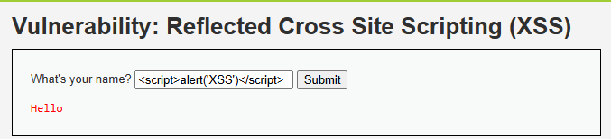
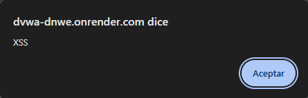

# 03 · XSS (Cross-Site Scripting) — Hotel Costa Brava

> **Informe A — Análisis de Vulnerabilidades · Criterios 3.1.1 / 3.1.4 / 3.1.5**
> Demostración del ataque de **XSS reflejado** sobre DVWA, su explicación, su gravedad
> (CVSS) y cómo lo prevendría/mitigaría Hotel Costa Brava.

## Objetivo de la sección

Demostrar cómo un atacante puede **ejecutar código en el navegador de un huésped**,
explicar por qué ocurre, medir su gravedad con CVSS y proponer las medidas de prevención
y mitigación para el hotel.

---

## Qué es (en simple)

Muchas páginas "repiten" lo que el usuario escribe: si pones tu nombre *Pedro*, la página
responde *"Hola Pedro"*. El **XSS** consiste en escribir, en lugar de un nombre, un pequeño
**programa** (un `<script>`). Si la página lo devuelve sin precaución, el navegador **no lo
muestra como texto: lo ejecuta**.

Es como dejar una nota en la recepción del hotel para otro huésped, pero en vez de un mensaje
escribes una **orden** que el recepcionista, sin darse cuenta, cumple al leerla en voz alta.

---

## Evidencia del ataque

**Dónde:** módulo *XSS (Reflected)* de DVWA (nivel *Low*).
**Qué se escribió** en el campo del nombre:

```
<script>alert('XSS')</script>
```

**Resultado:** el navegador ejecutó el código y mostró una ventana emergente con el texto
"XSS" — prueba de que el código inyectado **corrió** en la página.





> Que aparezca solo "Hello" (sin el texto del `<script>`) confirma que el navegador
> **interpretó** la etiqueta en vez de mostrarla: el código se ejecutó.

---

## Por qué funciona (explicación técnica)

La aplicación **inserta la entrada del usuario dentro del HTML sin sanitizarla**:

```html
<!-- Entrada normal: Pedro -->
<p>Hola Pedro</p>                                  <!-- muestra: Hola Pedro -->

<!-- Entrada maliciosa: una etiqueta script -->
<p>Hola <script>alert('XSS')</script></p>          <!-- el navegador la EJECUTA -->
```

El navegador **no distingue** la entrada del usuario del código propio de la página. Si la
entrada llega "tal cual" al HTML, cualquier `<script>` que el atacante escriba se ejecuta en
el navegador de quien abra esa página.

**Tipos de XSS:** reflejado (viaja en la URL/respuesta, como el de DVWA), almacenado (queda
guardado, p. ej. en un comentario) y basado en DOM.

---

## Gravedad — CVSS 3.1

Calculado con la [calculadora oficial FIRST](https://www.first.org/cvss/calculator/3.1):

| Métrica | Valor | Razón |
|---|---|---|
| Vector de ataque (AV) | **Red (N)** | Se explota por internet |
| Complejidad (AC) | **Baja (L)** | Basta un enlace preparado |
| Privilegios (PR) | **Ninguno (N)** | No requiere cuenta del atacante |
| Interacción (UI) | **Requerida (R)** | La víctima debe abrir el enlace |
| Alcance (S) | **Cambiado (C)** | El código corre en el navegador de la víctima |
| Confidencialidad (C) | **Baja (L)** | Puede robar la sesión/cookies |
| Integridad (I) | **Baja (L)** | Puede alterar la página o engañar |
| Disponibilidad (A) | **Ninguna (N)** | No tumba el servicio |

**Vector:** `CVSS:3.1/AV:N/AC:L/PR:N/UI:R/S:C/C:L/I:L/A:N`
**Puntaje base: 6.1 — Severidad MEDIA.**
**En lenguaje simple: 🟡 Moderada — planificar corrección.**

---

## Impacto para Hotel Costa Brava

- **Robo de sesión:** el atacante envía a un huésped un enlace al portal con el código
  oculto; al abrirlo, le roba la cookie de sesión y **entra a su cuenta** (reservas, datos,
  pagos).
- **Phishing dentro del sitio real:** puede inyectar un formulario falso de pago o login en
  el portal *verdadero* del hotel → la víctima confía y entrega sus datos.
- **Redirección** a sitios maliciosos desde el dominio del hotel.
- **Daño reputacional:** el ataque ocurre "dentro" del sitio legítimo del hotel.

---

## Prevención (3.1.4) — evitar que ocurra

1. **Escapar/codificar la salida:** convertir `<` en `&lt;`, `>` en `&gt;`, etc., para que lo
   que el usuario escribe se **muestre como texto** y nunca se ejecute. Es la defensa #1.
2. **Usar el escape automático del framework** (React, por ejemplo, escapa por defecto) y no
   desactivarlo (evitar `dangerouslySetInnerHTML` sin sanitizar).
3. **Validar y limitar las entradas** (longitud, caracteres permitidos según el campo).
4. **Sanitizar** el contenido enriquecido con una librería confiable cuando se deba permitir
   HTML (p. ej. reseñas).

## Mitigación (3.1.5) — reducir el daño si ocurre

1. **Content Security Policy (CSP):** indica al navegador qué scripts puede ejecutar, de modo
   que un `<script>` inyectado quede bloqueado.
2. **Cookies `HttpOnly` y `Secure`:** evitan que el JavaScript inyectado lea la cookie de
   sesión (corta el robo de sesión).
3. **Sesiones de corta duración** y revalidación en acciones sensibles (pagos).
4. **WAF** que filtre patrones de scripts en las entradas.

---

## Conclusión de la sección

El XSS aprovecha que el navegador **confía** en todo lo que la página le entrega. Para Hotel
Costa Brava, el mayor riesgo es el **robo de sesión de un huésped** y el **phishing dentro de
su propio portal**. Se previene **escapando la salida** y se mitiga con **CSP y cookies
HttpOnly**, medidas de bajo costo y alto efecto.
