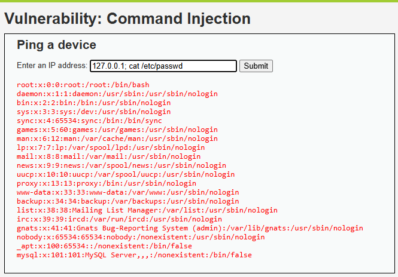

# 04 · Inyección de comandos — Hotel Costa Brava

> **Informe A — Análisis de Vulnerabilidades · Criterios 3.1.1 / 3.1.4 / 3.1.5**
> Demostración del ataque de **inyección de comandos** sobre DVWA, su explicación, su
> gravedad (CVSS) y cómo lo prevendría/mitigaría Hotel Costa Brava.

## Objetivo de la sección

Demostrar cómo un atacante puede **ejecutar órdenes en el servidor** del hotel a través del
portal, explicar por qué ocurre, medir su gravedad con CVSS y proponer las medidas de
prevención y mitigación. Es el ataque **más grave** de los tres: equivale a tomar el control
del servidor.

---

## Qué es (en simple)

Algunas funciones del portal usan herramientas del propio servidor (por ejemplo, hacer un
*ping* para comprobar si un equipo responde). La **inyección de comandos** consiste en
agregar, después del dato esperado, **una segunda orden** que el servidor también ejecuta.

Es como pedirle al conserje "ve a buscar las llaves de la habitación 101" y agregar "…y de
paso ábreme la caja fuerte del hotel". Si el conserje obedece sin pensar, hace **ambas cosas**.

---

## Evidencia del ataque

**Dónde:** módulo *Command Injection* de DVWA (nivel *Low*).
**Qué se escribió** en el campo de la dirección IP:

```
127.0.0.1; cat /etc/passwd
```

**Resultado:** además del *ping*, el servidor mostró el contenido de `/etc/passwd`, un
archivo interno de Linux que **lista las cuentas de usuario del servidor** y que jamás
debería ser visible para un usuario del portal.



> Leer `/etc/passwd` es solo la **demostración**. El mismo mecanismo permite ejecutar
> *cualquier* comando: leer otros archivos, borrar datos o instalar software.

---

## Por qué funciona (explicación técnica)

El portal **arma una orden para el sistema operativo pegando** la entrada del usuario:

```bash
# Entrada normal: 127.0.0.1
ping -c 4 127.0.0.1                       # solo ejecuta el ping

# Entrada maliciosa: 127.0.0.1; cat /etc/passwd
ping -c 4 127.0.0.1; cat /etc/passwd      # el ; encadena DOS comandos
```

En una terminal, el carácter `;` significa "ejecuta un comando y, a continuación, el
siguiente". Como la aplicación entrega la entrada **directamente al sistema operativo**, el
servidor ejecuta los dos. La causa de fondo es la misma de siempre: **no se separan los datos
del usuario de las instrucciones** del sistema.

---

## Gravedad — CVSS 3.1

Calculado con la [calculadora oficial FIRST](https://www.first.org/cvss/calculator/3.1):

| Métrica | Valor | Razón |
|---|---|---|
| Vector de ataque (AV) | **Red (N)** | Se explota por internet |
| Complejidad (AC) | **Baja (L)** | Basta encadenar un comando |
| Privilegios (PR) | **Ninguno (N)** | A través de una función pública del portal |
| Interacción (UI) | **Ninguna (N)** | No necesita engañar a nadie |
| Alcance (S) | **Sin cambio (U)** | Se ejecuta en el mismo servidor |
| Confidencialidad (C) | **Alta (H)** | Lee cualquier archivo del servidor |
| Integridad (I) | **Alta (H)** | Puede modificar o borrar archivos |
| Disponibilidad (A) | **Alta (H)** | Puede apagar o inutilizar el servidor |

**Vector:** `CVSS:3.1/AV:N/AC:L/PR:N/UI:N/S:U/C:H/I:H/A:H`
**Puntaje base: 9.8 — Severidad CRÍTICA.**

> Es la vulnerabilidad más grave de las tres: otorga **control total del servidor**
> (ejecución remota de comandos), lo que abre la puerta a todo lo demás.

---

## Impacto para Hotel Costa Brava

- **Control total del servidor:** acceso a *toda* la información (huéspedes, reservas, pagos)
  y a otros sistemas conectados (p. ej. el PMS del hotel).
- **Ransomware / sabotaje:** cifrar o borrar los datos → el hotel no puede operar ni recibir
  reservas.
- **Robo masivo de datos** y uso del servidor como plataforma para nuevos ataques.
- **Interrupción del negocio:** caída del portal de reservas = pérdida directa de ingresos.

---

## Prevención (3.1.4) — evitar que ocurra

1. **No pasar nunca la entrada del usuario directamente al sistema operativo.** Evitar
   funciones como `system()`, `exec()` o `shell_exec()` con datos del usuario.
2. **Usar APIs/librerías seguras** que realicen la tarea sin invocar la terminal (p. ej. una
   librería de red para el ping, en vez de llamar al comando del sistema).
3. **Listas blancas (whitelisting):** aceptar únicamente valores con el formato exacto
   esperado (p. ej. validar que la entrada sea una IP válida y nada más).
4. **Estándar de código seguro** y revisión antes de publicar.

## Mitigación (3.1.5) — reducir el daño si ocurre

1. **Privilegios mínimos del proceso web:** que el servicio del portal corra con una cuenta
   sin permisos de administrador, de modo que un comando inyectado pueda hacer poco.
2. **Aislamiento (contenedores / sandbox)** y **segmentación de red**, para que comprometer
   el portal no dé acceso al resto de la infraestructura (PMS, base de datos).
3. **Monitoreo y alertas** de procesos y comandos inusuales; **monitoreo de integridad de
   archivos**.
4. **WAF** que detecte y bloquee patrones de inyección de comandos (`;`, `|`, `&&`, etc.).

---

## Conclusión de la sección

La inyección de comandos es la falla **más crítica** (CVSS 9.8): convierte una función
inofensiva del portal en **control total del servidor** del hotel. Se previene **no enviando
nunca la entrada del usuario a la terminal** y usando **listas blancas**, y se mitiga con
**privilegios mínimos y aislamiento**, para que —si algo falla— el daño quede contenido.
